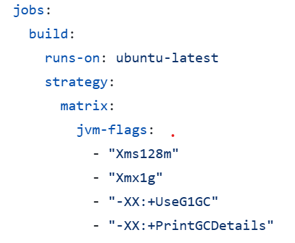

# Zaky-Laurent Documentation Tâche 3

## Informations
Projet: Makelangelo \
Équipe: Zaky Harras / Laurent Bouchard

### Répertoires
Voici les répertoires importants
- [src/main/java/com/marginallyclever](..%2Fsrc%2Fmain%2Fjava%2Fcom%2Fmarginallyclever) : \
  Là où se trouve le code principal du logiciel
- [.github/workflows/test.yml](.github%2Fworkflows%2Ftest.yml) : \
  Là où se trouve le fichier yml des github actions

### Changements apporté à la github actions
Ajout du code suivant sous la ligne 9 du fichier test.yml: \

### Justification du choix des flags:
| Flag                | Description                                    | Justification                                                                                                                                                                                                                                                                                           |
|:--------------------|:-----------------------------------------------|:--------------------------------------------------------------------------------------------------------------------------------------------------------------------------------------------------------------------------------------------------------------------------------------------------------|
| Xms1g               | Donne au heap une taille initiale de 1 GB      | Permet d'allouer assez de mémoire au heap pour éviter de devoir agrandire le taille du heap trop souvent et ainsi avoir de meilleure performances pour les exécutions de petites taille.                                                                                                                |
| Xmx2g               | Donne au heap une taille maximale de 2 GB      | Limite la mémoire du heap à 2 GB. Ainsi, cela nous permet de clairement voir si le programme est mal optimisé en mémoire (outOfMemoryError) et nous amènes à utiliser des algoritmes plus efficace en espace.                                                                                           |
| XX:+UseG1GC         | Active le ramasse-miette G1                    | Ce flag assure que le ramasse-miette utilisé est G1GC. G1GC est optimisé pour avoir à la fois une faible latence et un bon débit et est le ramasse-miette par défaut pour la plupart des JVM.                                                                                                           |
| XX:+PrintGCDetails  | Crée des logs de l'activité du ramasse-miette  | Les logs crées par ce flag permettent d'avoir plusieurs information par rapport au ramasse-miette, comme le nombre de fois que le ramasse-miette s'active et le temps pris par le ramasse-miette. Ainsi, cela nous permet de comparer les perfomences de différents ramasse-miette et de mieux optimiser|
